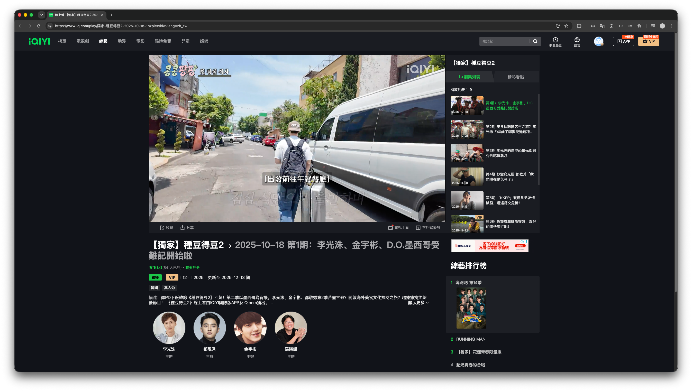
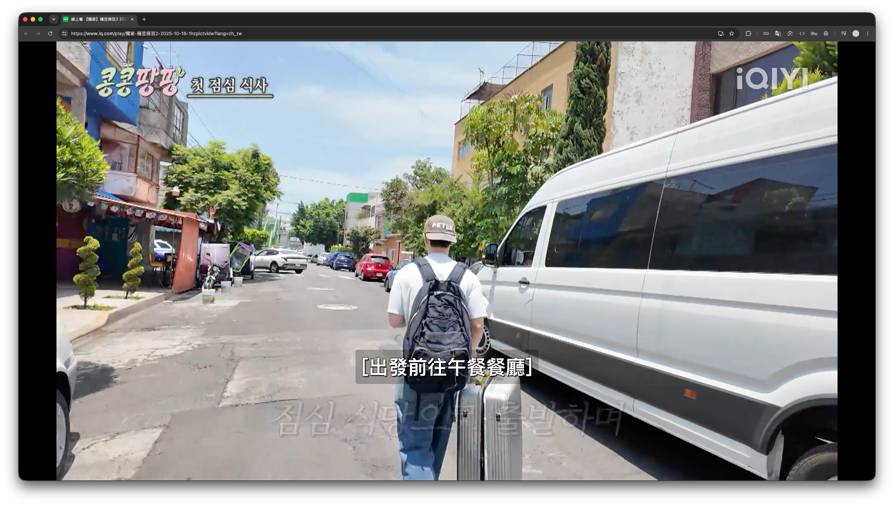

<div align="center">

[](https://chromewebstore.google.com/detail/akgblinimdheojahjonfijjmfdclcili?utm_source=item-share-cb)

# [iQIYI Full View](https://chromewebstore.google.com/detail/akgblinimdheojahjonfijjmfdclcili?utm_source=item-share-cb)

**"When the official video player is a bit stingy with screen space"**

   [](https://chromewebstore.google.com/detail/akgblinimdheojahjonfijjmfdclcili?utm_source=item-share-cb) [](./docs/README.zh-TW.md)

</div>

This is a Chrome browser extension that lets users quickly toggle an "in-page full-window" playback mode on [iQIYI](https://www.iq.com/) video pages.

iQIYI's default player is relatively small, and enlarging the viewing area normally requires switching to fullscreen mode. To solve this, the extension expands the player to fill the entire browser viewport, making better use of screen space. It is suitable for users who want a larger viewing area without entering system fullscreen mode.

## Demo

Default iQIYI player:



Full View mode:



## Installation

- **Official installation (recommended):**

  - Install directly from the Chrome Web Store: [📥 Install iQIYI Full View](https://chromewebstore.google.com/detail/akgblinimdheojahjonfijjmfdclcili?utm_source=item-share-cb)

- **Developer installation:**

  1. Download or clone this project.

     ```bash
     git clone git@github.com:DYC-DD/iQIYI-full-view.git
     ```

  2. Open Chrome and go to `chrome://extensions`.
  3. Enable "Developer mode" in the top-right corner.
  4. Click "Load unpacked".
  5. Select this project folder.

After installation, open an [iQIYI](https://www.iq.com/) video page to use the extension.

## Features

- Toggle in-page full-window playback without entering system fullscreen.
- Hide selected page chrome while Full View is active so the player can use more browser viewport space.
- Optional popup switch to automatically click ad close buttons on iQIYI pages.

## Usage

| Shortcut                    | Action                          |
| --------------------------- | ------------------------------- |
| `F` / `Right-click`         | Toggle in-page full-window mode |
| `F` / `Right-click` / `Esc` | Exit in-page full-window mode   |

To use auto-close ads, open the extension popup and turn on **Auto-close ads**. This setting is off by default and is remembered locally after you change it.

> [!TIP]
>
> If focus is inside an input field, text area, or editable content, the extension will not intercept the `F` shortcut.

## Permissions

This extension uses the following permissions:

- `scripting`: Registers and runs the page content script.
- `contextMenus`: Provides a right-click option to toggle Full View on iQIYI video pages.
- `storage`: Saves extension settings locally, such as the auto-close ads switch.
- `host_permissions`: Restricts operation to [iQIYI](https://www.iq.com/) related domains.

> [!IMPORTANT]
>
> This extension does not:
>
> - collect personal data
> - store browsing history
> - send data to any server
> - access pages outside iQIYI-related domains
> - modify your account, subscription, or payment information

## Changelog

For the full update history, please refer to the [CHANGELOG](./docs/CHANGELOG.md)

## License

[MIT License](./LICENSE)
